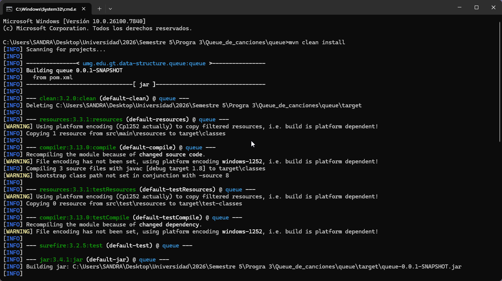
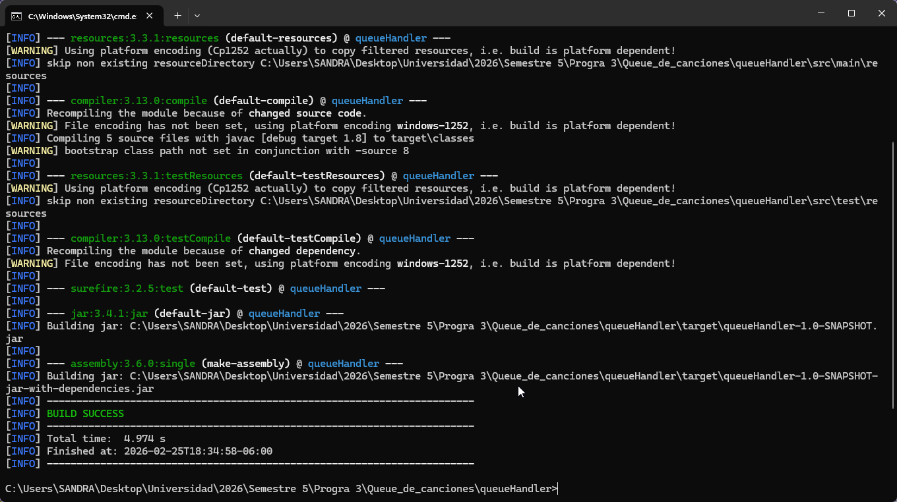
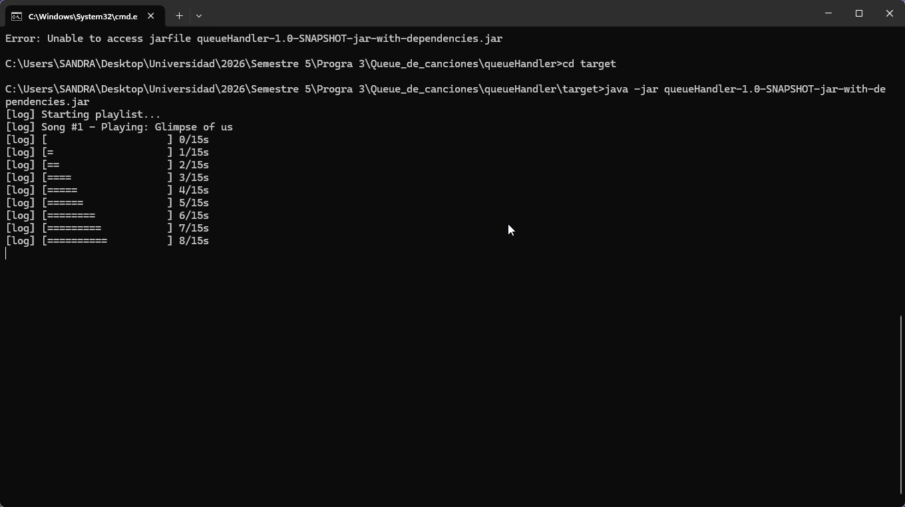
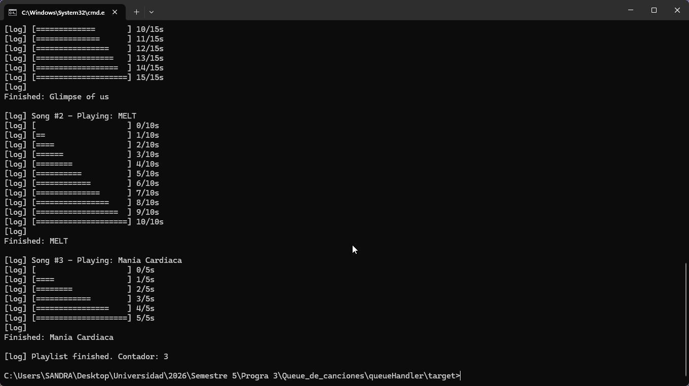
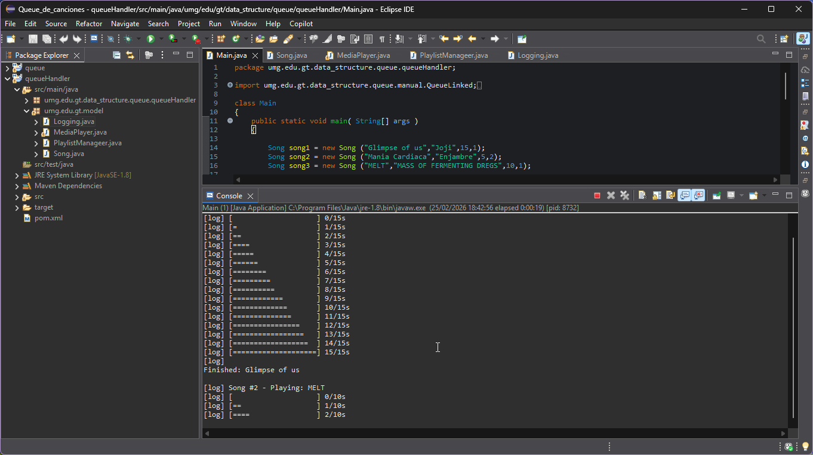

# Simulador de Reproducción de Música (Queue System)

Este proyecto es una simulación de un reproductor tipo Spotify desarrollado en Java. Utiliza una arquitectura modular basada en Maven y una estructura de datos de **Cola (Queue)** implementada manualmente desde cero (sin usar el Java Collections Framework).

## 🚀 Características Principales
- **Estructura de Datos Manual:** Implementación de una `QueueLinked<T>` basada en nodos con operaciones $O(1)$.
- **Sistema de Prioridades:** Gestión de canciones por niveles (Alta y Normal).
- **Simulación Realista:** Reproducción segundo a segundo con barra de progreso visual en consola.
- **Arquitectura Modular:** Separación entre la librería de estructuras de datos y la lógica de aplicación (Handler).

---

## Estructura del Proyecto

```text
/
├── umg.edu.gt.data-structure.queue  # Librería de la Cola (Proyecto A)
├── queueHandler                     # Aplicación del Reproductor (Proyecto B)
├── evidencias                       # Capturas de pantalla del funcionamiento
└── README.md                        # Documentación
```

---

## Instalación y Configuración

### 1. Compilar e Instalar la Librería (Queue)
Antes de ejecutar el reproductor, se debe instalar la librería en el repositorio local de Maven:

```bash
cd umg.edu.gt.data-structure.queue
mvn clean install
```
*Esto generará el artefacto necesario para que el `queueHandler` pueda consumir la `QueueLinked`.*

### 2. Compilar el Reproductor (Handler)
Navega a la carpeta del handler y genera el archivo ejecutable:

```bash
cd ../queueHandler
mvn clean package
```

---

## Ejecución desde Consola

Para ejecutar el programa, utiliza el **Fat JAR** generado en la carpeta `target`:

```bash
cd target
java -jar queueHandler-1.0-SNAPSHOT-jar-with-dependencies.jar
```

---

## Diseño y Decisiones Técnicas

### 1. Implementación de la Cola
Se desarrolló la clase `QueueLinked<T>` utilizando una estructura de **Nodos Enlazados**.
- **Eficiencia:** Las operaciones `enqueue` y `dequeue` son $O(1)$ gracias al mantenimiento de punteros `head` y `tail`.
- **Encapsulamiento:** No se exponen los nodos internos al usuario de la librería.
- **Genéricos:** La cola soporta cualquier tipo de objeto (`T`).

### 2. Sistema de Prioridad
Para cumplir con el requerimiento de prioridad sin romper el principio FIFO, se utilizó la **Estrategia de Doble Cola**:
- **HighPriorityPlaylist:** Almacena canciones con prioridad 1.
- **NormalPriorityPlaylist:** Almacena canciones con prioridad 2.
- **Lógica:** El `MediaPlayer` procesa primero todos los elementos de la cola de alta prioridad y, al finalizar, procede con la cola normal.

### 3. Simulación de Tiempo Real
Se utiliza `Thread.sleep(1000)` dentro de un bucle que recorre la duración de la canción. Para la barra de progreso, se calcula el porcentaje completado y se renderiza dinámicamente en la consola:
`[==========----------] 5s / 10s`

---

## Mejoras Implementadas (Parte D)
Se incluyeron las siguientes extensiones de complejidad:
1.  **Barra de Progreso Visual:** Representación gráfica del avance de la canción mediante caracteres `=` y espacios.
2.  **Contador de Reproducción:** El sistema mantiene un conteo correlativo de las canciones reproducidas a través de las diferentes colas.

---

## Evidencias de Funcionamiento

A continuación, se adjuntan las capturas del proceso (los archivos deben estar en la carpeta `/evidencias` del repositorio):

### 1. Instalación de Librería (mvn clean install)


### 2. Compilación del Proyecto (mvn clean package)


### 3. Ejecución y Barra de Progreso





### 4. Salida Final y Logs

"# Queue_de_canciones" 
